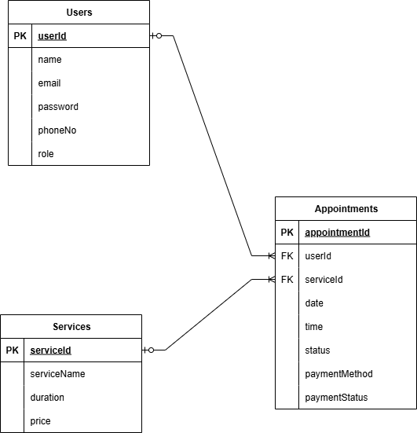
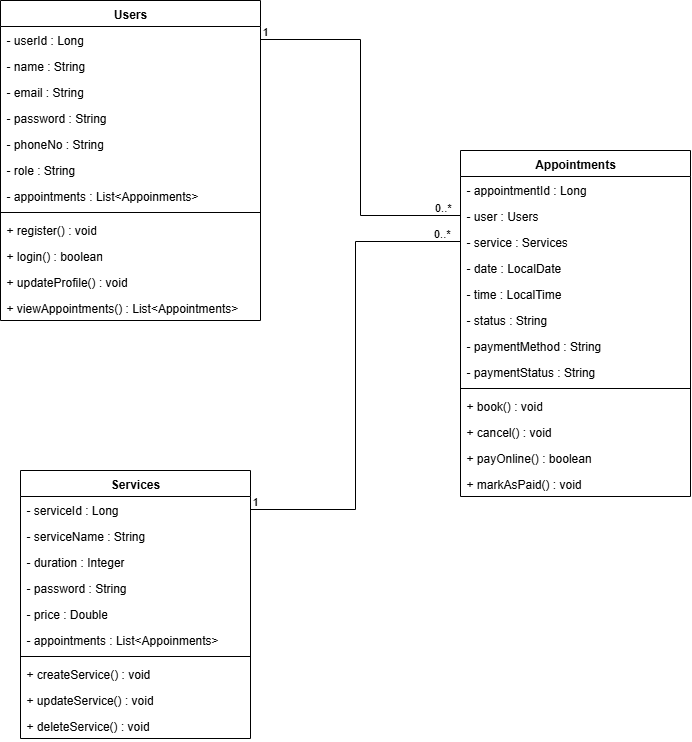

# 💈 Barbershop Booking System

This is a full-stack **Barbershop Booking System** designed and built as a professional portfolio project.  
It helps local barbershops manage services, bookings, and payments online — including **ToyyibPay** payment integration for Malaysia.

---

## 📌 Project Goals

- Demonstrate real-world problem solving.
- Show proficiency with **Java**, **Spring Boot**, **MySQL**, **JPA/Hibernate**, **REST APIs**, **Bootstrap**, **Docker**, and **GitHub workflow**.
- Deployable & maintainable code that simulates a real business scenario.

---

## ✅ Problem Statement

**Small barbershops struggle with:**
- Manual booking via phone/WhatsApp.
- Missed appointments due to no-shows.
- Inefficient cash handling.
- Limited online presence.

This system solves that by providing:
- Easy online appointment booking.
- Service selection.
- Online payment via **ToyyibPay** or cash on site.
- Admin dashboard for barbers to manage services and bookings.

---

## ⚙️ Core Features

- ✅ User registration & login (basic auth for now).
- ✅ Customer can browse services.
- ✅ Customer can book an appointment.
- ✅ Payment options: Online (ToyyibPay) or cash.
- ✅ Admin can manage services.
- ✅ Admin can view all appointments.
- ✅ Optional: Email notifications (future stretch goal).

---

## 📌 ERD

  


**Tables:**
- `users` — customers & admin
- `services` — haircut options
- `appointments` — bookings with payment details

**Key Relationships:**
- One `User` → many `Appointments`
- One `Service` → many `Appointments`
- `Appointment` must belong to both a `User` and a `Service`

---

## 📌 Class Diagram

  


**Highlights:**
- `User` → fields: id, name, email, phone, role.
- `Service` → fields: id, name, duration, price.
- `Appointment` → fields: id, date, time, status, payment method, payment status.
- Key actions: register, login, book, cancel, pay online.

---

## ✅ Tech Stack

| Layer | Tech |
|-------|------|
| Backend | Java, Spring Boot, Spring Data JPA |
| Database | MySQL |
| Frontend | HTML, Bootstrap, Thymeleaf  |
| Payment Gateway | ToyyibPay Sandbox |
| Version Control | Git & GitHub |
| Deployment | Docker (local dev) |

---

## 📌 Business Rules

- Only registered customers can book an appointment.
- Each appointment must have exactly one service.
- Customers choose between online payment (ToyyibPay) or cash.
- Online payments must update status after ToyyibPay callback.
- Admin can add, update, or remove services.
- Admin can see all bookings.

---

## 📌 How to Run

1. Clone this repo:
   ```bash
   git clone https://github.com/HarizIkhwann/barbershop-booking.git
   cd barbershop-booking

## ✅ Day 3 Progress

- Implemented CRUD REST API for:
    - Users
    - Services
    - Appointments
- Tested with Postman.
- Database runs on PostgreSQL in Docker.
- Hibernate auto-generates tables.
- Ready for ToyyibPay integration and front-end connection next.

### 📌 Example Endpoints
- `POST /api/users`
- `GET /api/users/{id}`
- `PUT /api/users/{id}`
- `DELETE /api/users/{id}`
- Same for `/services` and `/appointments`.

### 📌 Tech Stack
- Java 17
- Spring Boot 3.x
- Spring Data JPA
- PostgreSQL
- Docker